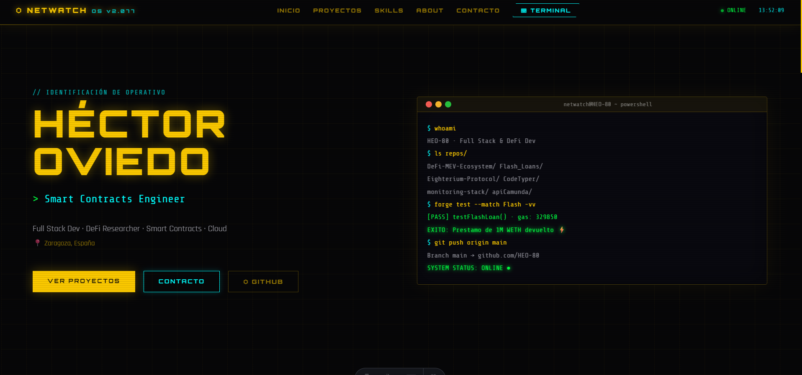
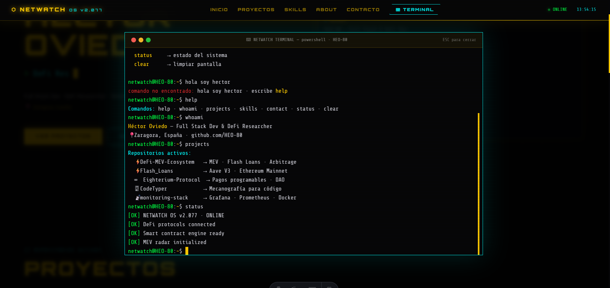

<div align="center">

# ⬡ NETWATCH OS v2.077


**Portfolio personal con identidad de sistema operativo Cyberpunk.**

*Boot screen · Terminal real interactiva · HUD · Glitch effects · Grid animado*

</div>

---

## 📸 Preview

| Hero + Terminal simulada | Navegación HUD |
|:---:|:---:|
|  |  |

---

## ✨ Características

- **Boot screen** — secuencia de arranque con logs del sistema y barra de progreso. Cualquier tecla para inicializar
- **HUD bar** — navegación fija con reloj en tiempo real y estado del sistema
- **Terminal simulada** — en el hero, reproduce automáticamente comandos reales (`forge test`, `git push`, `[PASS]`)
- **Terminal real** (xterm.js) — abierta con el botón TERMINAL, acepta comandos: `whoami`, `projects`, `skills`, `contact`, `status`, `clear`
- **Glitch effects** — en títulos, nav links y botones
- **Grid animado** — fondo con rejilla en movimiento continuo
- **Scanlines** — overlay de líneas de TV sobre toda la interfaz
- **Typing effect** — roles rotativos en el hero
- **Skill bars** — animadas al cargar con CSS puro

---

## 🗂️ Estructura

```
portfolio-cyberpunk/
├── src/
│   ├── assets/
│   │   └── img/
│   │       ├── page1.png
│   │       └── page2.png
│   ├── layouts/
│   │   └── Layout.astro     ← HTML base + fuentes + estilos globales
│   └── pages/
│       └── index.astro      ← Todo el portfolio en un único archivo
├── astro.config.mjs
└── package.json
```

---

## 🚀 Instalación

```bash
git clone https://github.com/HEO-80/portfolio-cyberpunk.git
cd portfolio-cyberpunk
npm install
npm run dev
```

Abre `http://localhost:4321`

---

## ⌨️ Comandos de la terminal

Una vez dentro del portfolio, pulsa el botón **TERMINAL** en la nav:

| Comando | Descripción |
|:---|:---|
| `help` | Listar comandos disponibles |
| `whoami` | Perfil del operativo |
| `projects` | Repositorios activos |
| `skills` | Módulos instalados |
| `contact` | Canales de comunicación |
| `status` | Estado del sistema |
| `clear` | Limpiar pantalla |

---

## 🛠️ Stack

| Tecnología | Uso |
|:---|:---|
| Astro | Framework principal |
| xterm.js | Terminal real en el navegador |
| GSAP | Animaciones (próxima iteración) |
| Orbitron + Share Tech Mono | Tipografías HUD |
| CSS puro | Grid animado · Glitch · Scanlines · Skill bars |

---

## 🗺️ Roadmap

- [x] Boot screen con secuencia de arranque
- [x] HUD bar con reloj en tiempo real
- [x] Hero con typing effect y glitch
- [x] Terminal simulada con comandos reales
- [x] Terminal real interactiva (xterm.js)
- [x] Secciones: Proyectos · Skills · About · Contacto
- [ ] Integrar GSAP ScrollTrigger en secciones
- [ ] Animaciones de entrada con stagger
- [ ] Versión móvil responsive
- [ ] Modo "filesystem" — navegar proyectos como directorios
- [ ] Deploy en Vercel

---

## 🧑‍💻 Autor

**Héctor Oviedo** — Full Stack Dev & DeFi Researcher

[](https://www.linkedin.com/in/hectorob/)
[](https://github.com/HEO-80)
[](https://landing-page-react-hector.vercel.app)

---

<div align="center">
  <sub>⬡ NETWATCH OS v2.077 · Built with Astro · <strong>Héctor Oviedo</strong> · Zaragoza, España</sub>
</div>
